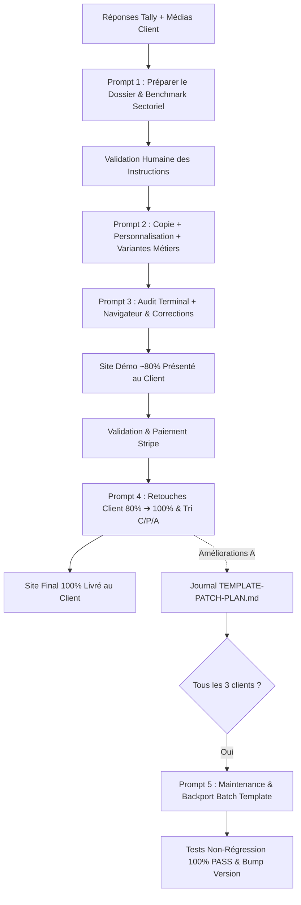

# 🧭 GUIDE OFFICIEL DES PROMPTS WEBEXPRESSO (v3.0)
## Méthode de Personnalisation Haute Performance & Multi-Secteurs

---

## 🎯 Philosophie & Architecture

WebExpresso repose sur un **Template Maître unique (v2.4.0)** conçu pour s'adapter avec un niveau d'excellence visuelle égal à n'importe quel secteur d'activité (Beauté, Artisanat d'Art, Restauration, Conseil B2B, Médical, Architecture).

Il n'existe **aucun générateur automatique en boîte noire**. La création d'un site client s'effectue via **3 Prompts d'ingénierie manuelle** appliqués séquentiellement :



---

## 📑 La Chaîne Complète des 5 Prompts

| Prompt | Fichier Source | Rôle Principal | Sorties Produites |
|---|---|---|---|
| **Prompt 1** | [`instructions/PROMPT_1_PREPARER.md`](file:///c:/Users/33783/Documents/Informatique/WebExpress/Technique/Phase%202%20_%20Template%20et%20master%20prompt/instructions/PROMPT_1_PREPARER.md) | **Benchmark web sectoriel (3 sites de référence)**, qualification des faits, sélection des variantes métiers et rédaction des spécifications. | `client-brief.json`<br>`site-spec.json`<br>`site-content.json`<br>`missing-information.md`<br>+ **Synthèse décisionnelle (Formule, DA, Fonctionnalités) pour validation** |
| **Prompt 2** | [`instructions/PROMPT_2_PERSONNALISER.md`](file:///c:/Users/33783/Documents/Informatique/WebExpress/Technique/Phase%202%20_%20Template%20et%20master%20prompt/instructions/PROMPT_2_PERSONNALISER.md) | **Duplication manuelle de la copie cliente**, injection du design system sur-mesure (`tokens.css`), activation des variantes, injection du contenu et **contrôle de cohérence contextuelle**. | Site client personnalisé démo (~80%), conforme à l'offre (`essential` ou `autonomous`), `generation-report.md` |
| **Prompt 3** | [`instructions/PROMPT_3_AUDITER_CORRIGER.md`](file:///c:/Users/33783/Documents/Informatique/WebExpress/Technique/Phase%202%20_%20Template%20et%20master%20prompt/instructions/PROMPT_3_AUDITER_CORRIGER.md) | **Audit double (Terminal d'abord + Navigateur ensuite)**, tests fonctionnels, responsive, anti-overflow, zéro émoji, et **correction immédiate des anomalies**. | Site client démo 100% sans bug prêt pour présentation client, `qa-report.md` |
| **Prompt 4** | [`instructions/PROMPT_4_CORRIGER_SITE_CLIENT.md`](file:///c:/Users/33783/Documents/Informatique/WebExpress/Technique/Phase%202%20_%20Template%20et%20master%20prompt/template/instructions/PROMPT_4_CORRIGER_SITE_CLIENT.md) | **Finalisation post-validation/paiement (80% ➔ 100%)**, intégration des retours écrits du client, tri strict **C / P / A**, consignation des améliorations génériques dans `TEMPLATE-PATCH-PLAN.md`. | Site final 100% livré, journal des patches alimenté, 1-2 tours de révision max |
| **Prompt 5** | [`instructions/PROMPT_5_BACKPORT_BATCH_TEMPLATE.md`](file:///c:/Users/33783/Documents/Informatique/WebExpress/Technique/Phase%202%20_%20Template%20et%20master%20prompt/template/instructions/PROMPT_5_BACKPORT_BATCH_TEMPLATE.md) | **Maintenance périodique du Template Maître (tous les 3 clients)**, report des améliorations [A], validation par batterie complète de tests automatisés, bump de version SemVer. | Template Maître enrichi, 0 régression, historique conservé, version bumpée |
| **Prompt Légal** | [`instructions/PROMPT_CONFORMITE_LEGALE_FR.md`](file:///c:/Users/33783/Documents/Informatique/WebExpress/Technique/Phase%202%20_%20Template%20et%20master%20prompt/Template/template%201.1/instructions/PROMPT_CONFORMITE_LEGALE_FR.md) | **Conformité juridique & RGPD France**, mentions légales LCEN, bandeau cookies CNIL, politique de confidentialité, consentement formulaire et accessibilité RGAA. | Modale légale intégrée, bandeau cookies opt-in, case RGPD contact, conformité 100% |

---

## 🎨 Catalogue des Variantes Métiers du Template Maître (v2.4.0)

Dans `site-spec.json`, le Prompt 1 configure explicitement le bloc `variants` :

```json
"variants": {
    "hero": "editorial-split",
    "gallery": "photo-editorial",
    "prestations": "menu-list",
    "partners": "brand-showcase",
    "testimonials": "cards-grid"
}
```

### Détail des Variantes Disponibles :

1. **Section `hero`** :
   * `"cinematic-full"` (Standard recommandé par défaut) : Arrière-plan photographique immersif plein écran avec dégradé subtil vers la couleur de fond et centrage textuel d'impact (Artisans, Créateurs, Commerçants, Hôtellerie, Prestations haut de gamme).
   * `"editorial-split"` (Optionnel / Dérogatoire) : Mise en page asymétrique moderne 50/50 avec accroche textuelle à gauche et portrait/ambiance encadré à droite (réservé aux demandes spécifiques de mise en avant d'un portrait personnel).

2. **Section `gallery`** :
   * `"photo-editorial"` : Cartes photos généreuses avec badges flottants satinés, micro-zoom doux et lightbox intégrée (Créateurs, Beauté, Commerces).
   * `"browser-mockup"` : Fenêtre de navigateur macOS (`● ● ●`) avec barre d'URL cliquable (SaaS, Développeurs, Agences Web).
   * `"bento"` : Grille asymétrique mettant en lumière 1 projet phare et 2 ou 3 projets secondaires.

3. **Section `prestations`** :
   * `"pricing-cards"` : Cartes tarifaires complètes avec liste d'inclusions et bouton de réservation direct.
   * `"cards-expertise"` : Cartes de savoir-faire et compétences clés sans prix fixe (CTA demande d'étude).
   * `"menu-list"` : Carte épurée type salon de coiffure, spa ou restaurant avec filets pointillés et prix alignés à droite.

4. **Section `partners`** :
   * `"brand-showcase"` : Cartes de marques de prestige avec visuel photographique de soin/produit (`imageUrl`) et sous-titre de spécialité.
   * `"logo-cloud"` : Nuage minimaliste de logos vectoriels en niveaux de gris (B2B, institutionnel).

5. **Section `testimonials`** :
   * `"cards-grid"` : Grille 3 colonnes de cartes d'avis 5 étoiles avec badge vérifié et avatars initiales.
   * `"quote-editorial"` : Grande citation d'impact éditoriale centrée en typographie serif avec attribution soignée.

---

## 🛡️ Règles d'Or pour l'Opérateur

1. **Le Template Maître (`template/`) reste sanctuarisé** : Toute personnalisation s'effectue dans une copie extérieure (`tests_personnalisation/test_XX` ou dossier client).
2. **Le Benchmark guide les Tokens** : Les polices, la graisse des titres (`--font-heading-weight`) et la palette de `tokens.css` doivent toujours être calquées sur les standards des leaders du secteur analysés au Prompt 1.
3. **Zéro boîte vide** : Chaque composant activé doit être doté de données réelles, précises et illustrées.
